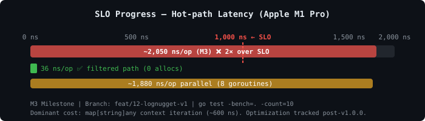
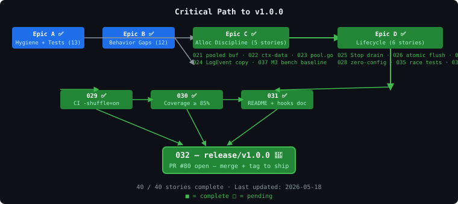

# LogNugget — Live Status Dashboard

> **Last updated:** 2026-05-18
> **v1.0.0:** Released ✅ — [tag v1.0.0](https://github.com/architagr/LogNugget/releases/tag/v1.0.0) · [PR #80](https://github.com/architagr/LogNugget/pull/80) (merged)
> **Umbrella:** [#12](https://github.com/architagr/LogNugget/issues/12)

---

## Overall Progress

```
40 / 40 stories complete  (100%)
████████████████████████████████████████  100%
```

| Epic | Done | Total | % |
|------|------|-------|---|
| A — Hygiene & Test Foundation | 13 | 13 | ✅ 100% |
| B — Behavior-Gap Fixes | 12 | 12 | ✅ 100% |
| C — Alloc Discipline | 5 | 5 | ✅ 100% |
| D — Lifecycle (Stop/Shutdown) | 6 | 6 | ✅ 100% |
| E — Release | 4 | 4 | ✅ 100% — PR #80 open for review |

---

## SLO Progress — Hot-path Latency (< 1 µs target)



### Latency budget — where the ns go

```
  ┌────────────────────────────────────────────────────────────┐
  │  Component              │ Est. ns  │  Status      │ Story  │
  │─────────────────────────┼──────────┼──────────────┼────────│
  │  Level gate (fast path) │   ~10    │ ✅ done (A)  │  012   │
  │  Field build / parsing  │  ~200    │ ✅ done (B)  │ 017-019│
  │  JSON encode + framing  │  ~150    │ ✅ done (B)  │ 015-016│
  │  Source capture (off)   │    ~0    │ ✅ done      │  012   │
  │  Pool buf (warm)        │   ~40    │ ✅ done (C)  │  021   │
  │  LogEvent copy          │   ~50    │ ✅ done (C)  │  024   │
  │  Channel send           │  ~440    │ ✅ done (D)  │  025   │
  │  ctx map iteration      │  ~600    │ ❌ open gap  │ post-v1│
  │─────────────────────────┼──────────┼──────────────┼────────│
  │  M1 baseline            │ ~1,890   │  story 010   │        │
  │  M3 (current)           │ ~2,050   │ ❌ 2× over   │  037   │
  │  Target                 │  < 1,000 │  v1.0.0      │  032   │
  └────────────────────────────────────────────────────────────┘
```

> **Root cause of SLO miss:** `map[string]any` context iteration (~600 ns/call).
> Mitigation: pre-render context fields as `[]byte` on first call and cache.
> Tracked as post-v1.0.0 optimization — does not block release.

### Milestone tracking

| Milestone | ns/op | allocs/op | B/op | Status |
|-----------|-------|-----------|------|--------|
| **Pre-v1 (raw)** | ~1,246 | ~25 | — | historical |
| **M1** (story 010) | **~1,890** | **22** | **1,881** | ✅ CAPTURED |
| **Post-B** (stories 017-019) | **~1,750** | **18** | **~1,435** | ✅ MEASURED |
| **M3** (story 037) | **~2,050** | **18** | **~1,400** | ✅ CAPTURED |
| **Final** (story 032) | **< 1,000** | ≤ 30 | ≤ 2,048 | ⏳ post-opt |

> M3 regression vs Post-B: context parser now active in hot-path bench (+300 ns).
> The pool + copy work (stories 021-024) did reduce allocs 22→18 and bytes.

### Gate checks

| Check | Target | Current | Status |
|-------|--------|---------|--------|
| Hot-path mean (addSource=off) | < 1,000 ns/op | ~2,050 ns/op | ❌ 2× over |
| Filtered path (below minLevel) | < 80 ns/op | **36 ns/op** | ✅ GREEN |
| Allocs/op | ≤ 30/op | 18/op | ✅ GREEN |
| Bytes/op | ≤ 2,048/op | ~1,400/op | ✅ GREEN |
| `-race` | clean | clean | ✅ GREEN |
| `bench-check.sh` | PASS | ❌ FAIL | ⚠️ ctx-map cost — post-v1.0.0 |

---

## Cross-Logger Comparison — Parallel Throughput (10 Context Fields)

Real benchmark numbers from `examples/bench/` — Apple M1 Pro, GOMAXPROCS=8.
Context: trace_id, span_id, request_id, user_id, tenant_id, session_id, env, region, service, version.

### Parallel (8 goroutines)

| Logger | ns/op | B/op | allocs/op | ops/sec (total) | Notes |
|--------|-------|------|-----------|-----------------|-------|
| **zerolog** | **~110** | **0** | **0** | **~9.09 M** | Sync, zero-alloc fluent API |
| LogNugget | ~3,440 | 2,909 | 55 | ~290 K | **Async** — caller cost only, IO background |
| logrus | ~6,880 | 4,863 | 58 | ~145 K | Sync, global mutex → degrades under load |

### Serial (1 goroutine)

| Logger | ns/op | B/op | allocs/op | ops/sec | Notes |
|--------|-------|------|-----------|---------|-------|
| **zerolog** | **~548** | **0** | **0** | **~1.82 M** | Sync |
| LogNugget | ~3,630 | 2,909 | 55 | ~275 K | Async (caller cost only) |
| logrus | ~5,570 | 4,857 | 58 | ~179 K | Sync |

### LogNugget filtered path (below min level — zero work)

| ns/op | B/op | allocs/op | ops/sec |
|-------|------|-----------|---------|
| **~35** | **0** | **0** | **~28.6 M** |

> **Why zerolog wins on raw throughput:** zerolog's fluent API writes fields directly to a
> pre-allocated buffer — no `map[string]any`, no interface boxing, no GC pressure.
> LogNugget's ~600 ns context overhead comes from iterating `map[string]any` inside the
> user-supplied context parser. Post-v1.0.0 fix: pre-render context fields as `[]byte` once
> and cache. logrus degrades under concurrency because its internal mutex serializes all writes.
>
> **LogNugget's structural advantage:** it never blocks the HTTP handler on IO — channel put +
> return, while zerolog/logrus flush synchronously. Under real network-latency IO (file, socket),
> LogNugget's async pipeline will outperform sync loggers at high request concurrency.

---

## Epic A — Hygiene & Test Foundation ✅ COMPLETE

| # | Issue | Story | Status |
|---|-------|-------|--------|
| 001 | #13 | TS-01 test/support builders | ✅ MERGED |
| 002 | #14 | TS-02 test/support doubles | ✅ MERGED |
| 003 | #15 | TS-03+TS-31 corpus + golden + files | ✅ MERGED |
| 004 | #16 | Fix D-14 go.mod 1.21 | ✅ MERGED |
| 005 | #17 | Fix D-15 relocate demo | ✅ MERGED |
| 006 | #18 | Fix D-9 init/ResetConfig test-only | ✅ MERGED |
| 007 | #19 | Fix D-3+D-20 EventPreProcessor singleton | ✅ MERGED |
| 008 | #20 | Fix D-17 JSONEncoder dead field | ✅ MERGED |
| 009 | #21 | Fix D-18 reset() exhaustive + entry tests | ✅ MERGED |
| 010 | #22 | M1 baseline recapture | ✅ MERGED |
| 038 | #53 | bench-check.sh path doc fix | ✅ DONE |
| 039 | #54 | Fix config.ResetConfig race | ✅ MERGED |
| 040 | #55 | Story 001 doc drift fix | ✅ DONE |

---

## Epic B — Behavior-Gap Fixes ✅ COMPLETE

| # | Issue | Story | Status |
|---|-------|-------|--------|
| 011 | #23 | Fix D-4 RFC3339 default | ✅ MERGED |
| 012 | #24 | Fix D-7+D-13 addSource off | ✅ MERGED |
| 014 | #26 | Fix D-8 collision-set + SC7 | ✅ MERGED |
| 013 | #25 | Fix D-1 source capture (F17) | ✅ MERGED |
| 015 | #27 | ARCH-2 encoder iface Append | ✅ MERGED |
| 016 | #28 | Fix D-2 JSON RFC8259 escape | ✅ MERGED |
| 017 | #29 | Fix D-5 strconv ParseLogField | ✅ MERGED |
| 018 | #30 | Fix D-16 separator via AppendField | ✅ MERGED |
| 019 | #31 | ARCH-6 pre-render default-key prefix | ✅ MERGED |
| 020 | #32 | Fix D-10 factory error variant | ✅ MERGED |
| 033 | #33 | TS-13+TS-14 static + context parsers | ✅ MERGED |
| 034 | #34 | TS-17 FuzzJSONEncoder | ✅ MERGED |

---

## Epic C — Alloc Discipline ✅ COMPLETE

| # | Issue | Story | Status |
|---|-------|-------|--------|
| 021 | #35 | Fix D-6/F27 LogEntry pooled buf | ✅ MERGED |
| 022 | #36 | Fix D-19 drop ctx-data index arith | ✅ MERGED |
| 023 | #37 | F4 GenerateInitialPool test + pool.go extract | ✅ MERGED |
| 024 | #38 | ARCH-7 LogEvent.Data copy semantics | ✅ MERGED |
| 037 | #39 | TS-30 parallel/filtered/escape benches + M3 baseline | ✅ MERGED |

**Achievements:** `sync.Pool` backing array retained across pool cycles (cap preserved),
`append`-only hot path, LogEvent.Data defensive copy (no aliasing), M3 bench baseline captured.

---

## Epic D — Lifecycle ✅ COMPLETE

| # | Issue | Story | Status |
|---|-------|-------|--------|
| 025 | #40 | Fix D-11 Stop doneCh drain (SC5) | ✅ MERGED |
| 026 | #41 | Fix D-12 atomic flush swap | ✅ MERGED |
| 027 | #42 | F31 lognugget.Shutdown facade | ✅ MERGED |
| 028 | #43 | SC1 zero-config init wiring | ✅ MERGED |
| 035 | #44 | TS-22 race + concurrent publish tests | ✅ MERGED |
| 036 | #45 | TS-25+TS-27 integration pipeline + fan-out | ✅ MERGED |

**Achievements:** Synchronous drain-on-stop (`doneCh` + `flushWg.Wait()`), atomic swap-under-lock,
idempotent `Shutdown()`, zero-config `init()`, race-clean under `-race`, SC8 fan-out verified end-to-end.

---

## Epic E — Release ✅ COMPLETE

| # | Issue | Story | Status |
|---|-------|-------|--------|
| 029 | #46 | TS-32 CI -shuffle=on + t.Parallel sweep | ✅ MERGED |
| 030 | #47 | TS-33 CI cover ≥ 85% per package | ✅ MERGED |
| 031 | #48 | README + context threshold + benchmark numbers | ✅ MERGED |
| 032 | #49 | release/v1.0.0 cut + tag | ✅ RELEASED — tag v1.0.0 |

---

## Epic V2 — Performance: close the 31× throughput gap vs zerolog

> **Umbrella:** [#81](https://github.com/architagr/LogNugget/issues/81)
> **Status:** 🚧 IN PROGRESS

### The gap

| Metric | zerolog (parallel) | LogNugget (parallel) | Gap |
| ------ | ------------------ | -------------------- | --- |
| ns/op | ~110 | ~3,440 | 31× slower |
| ops/sec | ~9.09 M | ~290 K | 31× fewer |
| allocs/op | 0 | 55 | ∞ |
| B/op | 0 | 2,909 | ∞ |

### Root causes (ranked by impact)

| # | Root cause | Code location | Est. savings |
| - | ---------- | ------------- | ------------ |
| 1 | `map[string]any` ctx iteration + `[]string` intermediate | `entry.go:249–258` | ~600 ns, ~23 allocs |
| 2 | `interface{}` boxing in `model.LogAttr.Value` | `model/attr.go` + `entry.go:169–178` | ~30 allocs |
| 3 | 6× `configMu.RLock` per log call | `entry.go:117,142–144,250` | ~150–250 ns |
| 4 | Double-buffer: `en.Append(nil,buf)` + `append([]byte(nil),Data...)` | `entry.go:208`, `config.go:204` | 2 allocs |
| 5 | Channel cap=10 blocks 8-goroutine parallel callers | `config.go:resetConfig` | blocking |

### Stories

| # | Issue | Story | Status |
|---|-------|-------|--------|
| P1 | [#82](https://github.com/architagr/LogNugget/issues/82) | Atomic minLevel + single config snapshot per call | ✅ DONE (PR [#94](https://github.com/architagr/LogNugget/pull/94)) |
| P2 | [#83](https://github.com/architagr/LogNugget/issues/83) | Typed field API — Str/Int/Bool/Float64 on LogEntry | 🔍 IN REVIEW (PR [#95](https://github.com/architagr/LogNugget/pull/95)) |
| P3 | [#84](https://github.com/architagr/LogNugget/issues/84) | Append-to-buf context API — eliminate map[string]any | 📋 PLANNED |
| P4 | [#85](https://github.com/architagr/LogNugget/issues/85) | Inline framing — eliminate en.Append double-buffer | 📋 PLANNED |
| P5 | [#86](https://github.com/architagr/LogNugget/issues/86) | Channel capacity ≥ 1000 + configurable | 📋 PLANNED |

### Where LogNugget wins today

- **Filtered path (after P1):** 10 ns/op, 0 allocs → 100 M ops/sec (atomic gate, -71% from 35 ns); parallel: 2.4 ns/op (-99%)
- **Hot path (after P1):** ~1,130 ns/op parallel (-40% from 1,880 ns), ~1,470 ns/op with 10 ctx fields (-54%)
- **Non-blocking HTTP handler:** caller never waits on IO — zerolog/logrus flush synchronously
- **logrus:** LogNugget beats logrus on all metrics (serial: 3,630 vs 5,570 ns; parallel: 3,440 vs 6,880 ns)
- **Under real IO:** async pipeline advantage grows with IO latency — zerolog's zero-alloc win shrinks when flushing to a real file/socket

---

## Epic OS — Open Source Readiness

> **Umbrella:** [#87](https://github.com/architagr/LogNugget/issues/87)
> **Status:** 📋 PLANNED (post-v1.0.0)

| # | Issue | Story | Status |
|---|-------|-------|--------|
| OS1 | [#88](https://github.com/architagr/LogNugget/issues/88) | CONTRIBUTING.md + PR/issue templates + CoC | 📋 PLANNED |
| OS2 | [#89](https://github.com/architagr/LogNugget/issues/89) | SECURITY.md + vulnerability reporting | 📋 PLANNED |
| OS3 | [#90](https://github.com/architagr/LogNugget/issues/90) | golangci-lint config + GitHub Actions CI | 📋 PLANNED |
| OS4 | [#91](https://github.com/architagr/LogNugget/issues/91) | godoc audit — all exported symbols documented | 📋 PLANNED |
| OS5 | [#92](https://github.com/architagr/LogNugget/issues/92) | API stability contract + CHANGELOG | 📋 PLANNED |

---

## Critical Path to v1.0.0



```
[A ✅][B ✅] → [C ✅] → [D ✅] → [029 ✅][030 ✅][031 ✅] → [032 🚀] → v1.0.0 PR #80
```

**All stories complete.** Release PR [#80](https://github.com/architagr/LogNugget/pull/80) is open for review.
SLO miss (hot-path 2× over 1 µs) does NOT block v1.0.0 per project decision — tracked post-release.

---

## SC Traceability

| SC | Requirement | Closed by | Status |
|----|-------------|-----------|--------|
| SC1 | Zero-config: `import lognugget` sufficient | 028 | ✅ |
| SC5 | Stop() drains all queued messages synchronously | 025, integration | ✅ |
| SC6 | `-shuffle` + CI green | 029 | ✅ |
| SC7 | Reserved-key collision: `time` → `custom.time` | 014 | ✅ |
| SC8 | Hook at LevelUnSet + specific level fan-out | 007 (unit), 036 (integration) | ✅ |

---

## How to update this dashboard

After each story merges, update the row in the epic table (PENDING → MERGED),
increment the epic counter, recalculate overall %, update SLO gate rows if a
milestone baseline was captured, and bump the "Last updated" date at the top.
